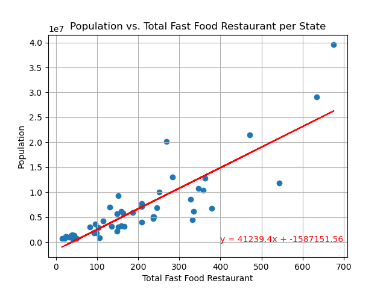
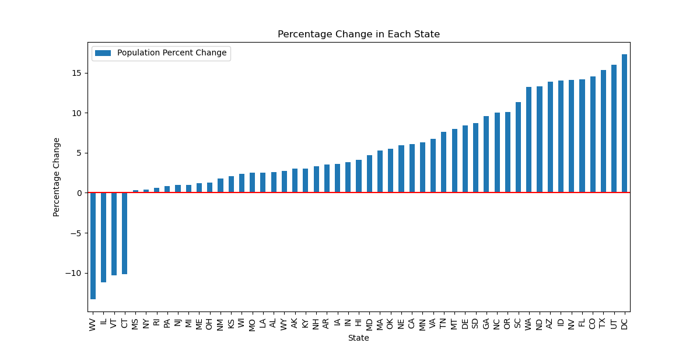
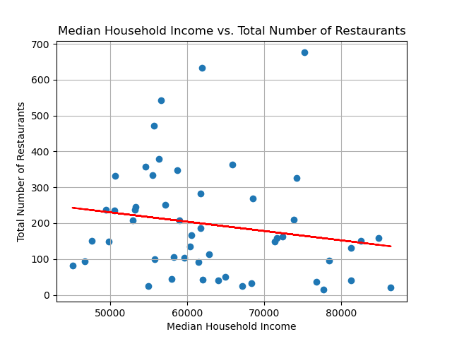
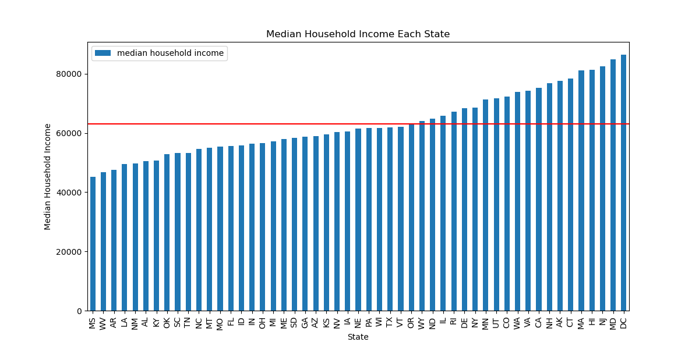
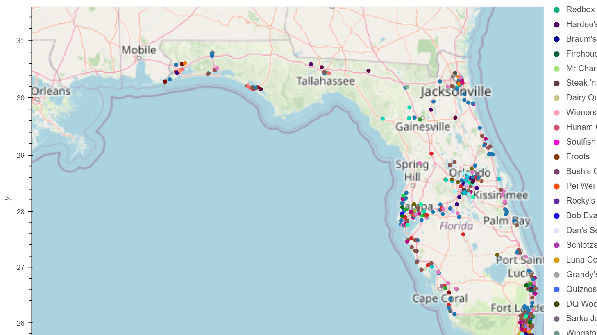
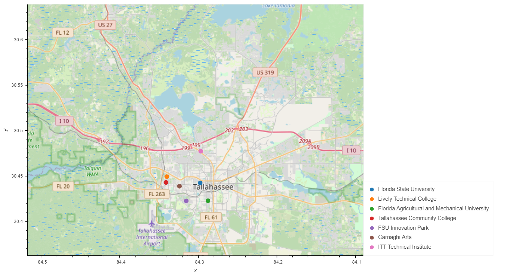
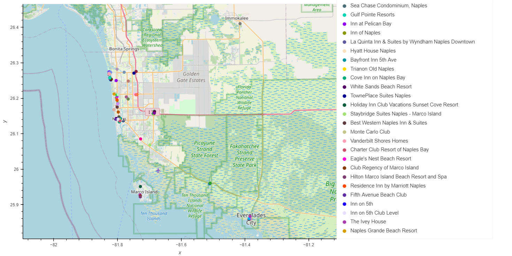

# Group3-project1

**What is this project about?**

We are a group of investors looking to open a new fast-food restaurant somewhere in the United States. Our goal was to gather and analyze data that would help us determine the best location to open a fast-food restaurant. We primarily looked at three different datasets: Population in each state, Number of restaurants in each state, and Household income for every state. Based on these three data sets, we plotted different bar graphs, and scatter plots as described below that helped us determine the best location.

**Population vs Number of Fast-food Restaurants:** 

We first looked at the total size of the population in every state and the total number of fast-food restaurants for each state by plotting separate bar graphs. For better visualization, we combined the population and restaurant data set for every state by plotting a Scatter chart as shown below: 
 
 

From the above plot, we were able to conclude that the number of restaurants is positively correlated to the population of any given state. In other words, the number of restaurants increases as the population increases.

**The ratio of percentage change in population to the number of fast-food restaurants in every state:** 

We dived a little deeper and determined the percentage change in population to the number of fast-food restaurants for every state.

Ratio of percentage change in population = (Total number of restaurants/population)*100

            

From the above bar graph, it is evident that in states where the population is lower, the ratio of restaurants to the total population seems to be higher. As the population varies, the number of fast food restaurants varies accordingly i.e. states, where the population is lower, the number of restaurants is also lower and vice-versa.

**Comparing average household income to the total population and the number of fast-food restaurants in each state:** 

The above scatter plot shows that the median household income is slightly negatively correlated to the Total number of restaurants. i.e. With the increase in household income, there is a decline in the number of fast-food restaurants for a given state.

Based on the above bar graph, the median household income seems to be around $63,000. Florida seems to be a potential place of interest for opening a restaurant as the population is averagely high and the household income is below the median.  
            
**Best location in Florida to open a new fast food restaurant:** 

Below are maps plotted using Geoapify APIs showing the number of fast-food restaurants across the state of Florida, the number of universities/colleges in Tallahassee as well as the hotels in Naples.

**Figure 1:** Map showing fast-food restaurants across Florida.

**Figure 2:** Map showing universities/colleges in Tallahassee.

**Figure 3:** Map showing hotels in Naples.

Based on the above maps, we chose Tallahassee and Naples as potential places to open fast-food restaurant(s) as the number of fast-food restaurants in Tallahassee and Naples is lower compared to other places across the state (Figure 1). Tallahassee being a college town has a high student population because of the various universities/colleges (Figure 2). With many attractions in Naples, it is another location that can benefit entrepreneurs to open another fast food restaurant due to a large number of tourists (Figure 3). 

**Implications:**

It is evident that there is an abundance of fast-food restaurants in the United States, but there are still plenty of locations to add more. These findings can be used to investigate other specific states outside of Florida. For future research, we can do more research on specific fast-food restaurants’ yearly revenue and revenue changes. Other points of the new research could include demographics from specific states, such as ethnicity and race. These could factor into the success of a fast food restaurant.
                                                                                                                                                                                                                                              
**Project folder structure:**

This project contains following directories and files:

1. "Group3-project1" is the main project folder
2. A "Resources" folder that contains the following CSV files:

- FastFoodRestaurants.csv (Source: https://www.kaggle.com/datasets/datafiniti/fast-food-restaurants)
- state_demographics.csv (Source: https://www2.census.gov/programs-surveys/cps/tables/time-series/historical-income-households/h08.xls)

3. Project1.ipynb - Main python jupyter notebook file

4. configy.py - python configuration file that contains API keys

5. An "Output" folder that contains following image files:
    - q1a.png
    - q1b.png
    - q1c.png
    - q2a.png
    - q2b.png
    - q3a.png
    - q3b.png
    - q3c.png
    - map.png
    - map_plot2_florida.png
    - Florida_School.png

**Breakdown**

Andrew Li: Main coder and cleanup. Assisted in editing the summary report/readme.  

Thomas Gresco: Main contributor in cleaning up demographics csv file and putting together the powerpoint.

Vineetha Bharadwaj: Assisted in cleaning up the restaurant names, put together the Summary Report and made edits to ReadMe file?

Euribiades Mota: Tried helping Vineetha with the Analysis and tried helping out with the code and also adding notes to it.

**Appendix**

https://www.kaggle.com/datasets/datafiniti/fast-food-restaurants

https://www2.census.gov/programs-surveys/cps/tables/time-series/historical-income-households/h08.xls

https://www2.census.gov/programs-surveys/popest/tables/2020-2022/state/totals/NST-EST2022-POP.xlsx

https://corgis-edu.github.io/corgis/datasets/csv/state_demographics/state_demographics.csv
